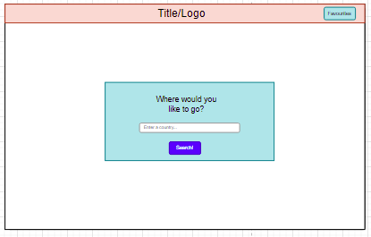
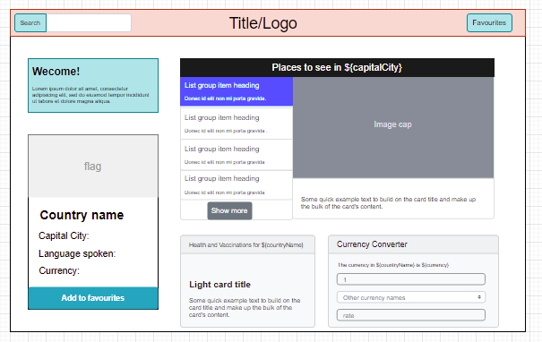
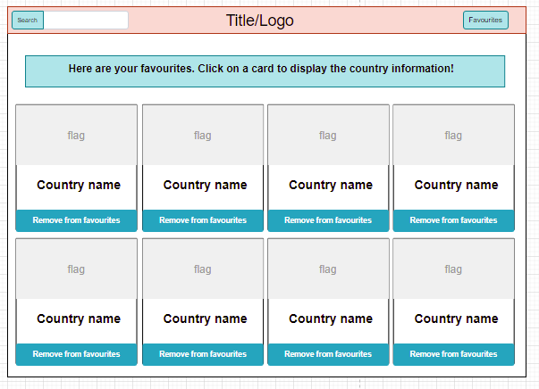
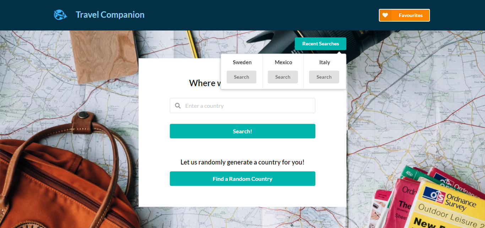
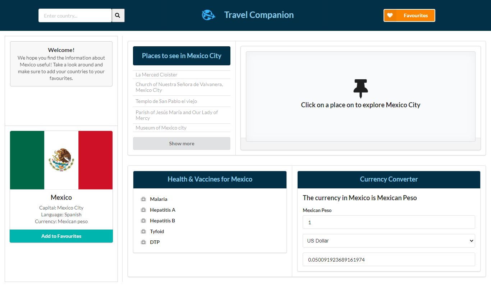
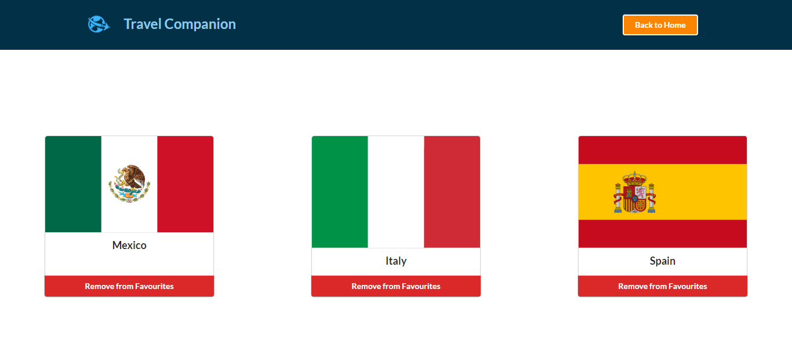
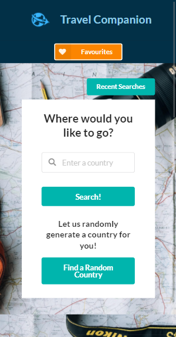
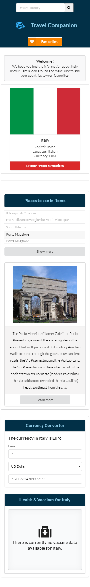
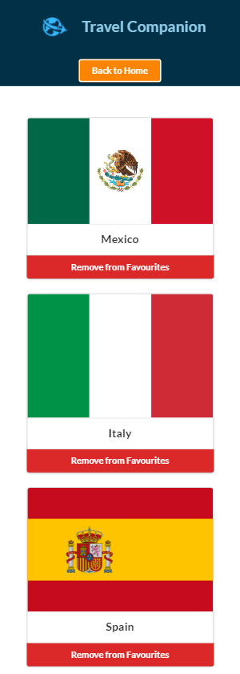
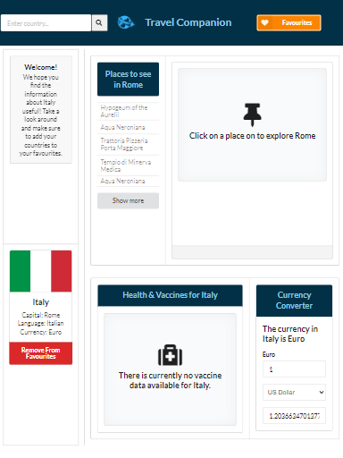

<div style="text-align:center"><a href="https://natasha-mann.github.io/travel-app/"></a></div>

<h1>Travel Companion</h1>

<h2> Table of Contents </h2>

- [Project Link](#project-link)
- [Getting Started](#getting-started)
- [Contributors](#contributors)
- [About the Project](#about-the-project)
  - [User Flows](#user-flows)
  - [Technologies Used](#technologies-used)
  - [Web APIs](#web-apis)
  - [Wireframes](#wireframes)
- [Plans for Improvement](#plans-for-improvement)
- [Screenshots](#screenshots)
  - [Desktop index page](#desktop-index-page)
  - [Desktop index page with recent searches](#desktop-index-page-with-recent-searches)
  - [Desktop results page](#desktop-results-page)
  - [Desktop favourites page](#desktop-favourites-page)
  - [Mobile index page](#mobile-index-page)
  - [Mobile results page](#mobile-results-page)
  - [Mobile favourites page](#mobile-favourites-page)
  - [Tablet](#tablet)

## Project Link

Click [here](https://natasha-mann.github.io/travel-app/) to view the project on GitHub pages.

## Getting Started

- Clone the GitHub project into your local machine
- Navigate into the project
- Open the project into VSCode
- Open the 'index.html' into your default browser

```
git clone git@github.com:natasha-mann/travel-app/.git
cd travel-app
code .
```

## Contributors

- Otilia: https://github.com/otivisan22
- Michael: https://github.com/Cratesy
- Pamela: https://github.com/PDUBB3
- Natasha: https://github.com/natasha-mann
- Hakel: https://github.com/Hakkelo89

## About the Project

The concept for this project was to develop a travel app which allows the user to find information about the countries of the world. As travel hasn't been possible for the past year due to Covid-19, we wanted to provide users with a way to discover new countries to be able to plan their post-covid travels.

### User Flows

On the home page a user can search for a country of their choice or click a button to generate a random country. The user can also click a button to view their last three searches.

Once the user has searched, the app navigates to the results page. On the results page the user is presented with various elements showing information about the searched country.

The elements include:

- A country card which displays the flag and gives information about the country's language, capital city and currency. The user can also click a button to add or remove the country from favourites.
- A places to see card which gives the user a list of places in the country's capital. When the user clicks on a place in the list, they are shown an image, a description and a button linking to an external site about the place.
- A health and vaccine card displaying information about the vaccines needed to travel to that country. On click of the vaccine, a modal appears with more information.
- A currency converter allowing the user to convert between the currency of the searched country and any other country in the world.

From either the home page or the results page, the user can click a button to navigate to the favourites page. On the favourites page the user is presented with cards for any country they have added to favourites. On click of the favourites card, the user is returned to the results page of the clicked country card.

### Technologies Used

For this project we used the following technologies:

- HTML
- CSS
- Semantic UI framework
- JavaScript
- jQuery

### Web APIs

We used three different APIs to get the required data for this project:

- [REST countries API](https://restcountries.eu/)
- [Travel Briefing API](https://travelbriefing.org/api)
- [Open Trip Map API](https://opentripmap.io/docs)

### Wireframes

> Note:
> During implementation some of these features were improved or changed.






## Plans for Improvement

- Skeleton loading
- Animation
  - Home page animation on search box
  - Micro-interactions
- Search bar on places card to allow the user to search for different cities
- Other features: Other third party APIs integrations such as hotel bookings or flight searches.

## Screenshots

### Desktop index page


### Desktop index page with recent searches



### Desktop results page



### Desktop favourites page



### Mobile index page



### Mobile results page



### Mobile favourites page



### Tablet



```

```
